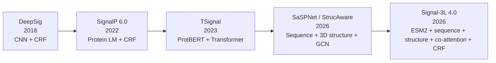

# SP Prediction: Comparative Review of Five Key Papers by Sajjad

> Everying started from DeepSig analysis: [DeepSig_connected](https://www.connectedpapers.com/main/f5655e2d2c16774c33b17e5a151352a8dfd82255/DeepSig%3A-deep-learning-improves-signal-peptide-detection-in-proteins/graph)
>
> So we analyze: DeepSig (2018), SignalP 6.0 (2022), TSignal (2023), SaSPNet
> / StrucAware (2026), and Signal-3L 4.0 (2026).
>
> To understand the main challenges and best architectures!

--------------------------------

# 1. Overview

## 1.1 The evolution in one picture



The progression is roughly:

| Paper | Main representation | Output mechanism | Main research emphasis |
|---|---|---|---|
| **DeepSig** | Learned local sequence features | CNN + structured prediction / CRF | Deep learning for SP detection + cleavage |
| **SignalP 6.0** | Protein-language-model embeddings | CRF | Better generalization + rare SP types |
| **TSignal** | ProtBERT contextual embeddings | Transformer encoder/decoder | Remove hard-coded SP structure and learn it directly |
| **SaSPNet** | ESM-2 + sequence + predicted 3D structure | CNN/BiLSTM/GCN + multimodal fusion | Minority SP classes |
| **Signal-3L 4.0** | ESM2 + sequence + predicted structure | Co-attention + CRF + CB-LDAM | Class imbalance + cleavage + multimodal fusion |

### My favorite! SaSPNET:


---

# 2. Main Question and Idea

## 2.1 DeepSig

### Question
Can deep neural networks learn useful signal-peptide patterns directly from protein sequences and improve SP detection and cleavage-site prediction?

### Idea
Use a **deep convolutional neural network** to learn local sequence patterns, explicitly considering the difficult distinction between signal peptides and transmembrane regions. A second structured-prediction stage is used for cleavage-site localization.

### Innovation
- CNN learns sequence features rather than relying mainly on handcrafted rules.
- Explicit attention to **N-terminal TM false positives**.
- Deep Taylor Decomposition is used to obtain relevance information for structured cleavage prediction.

**Key interpretation:** DeepSig represents the transition from classical handcrafted/structured approaches toward learned sequence representations.

---

## 2.2 SignalP 6.0

### Question
Can a **protein language model (PLM)** solve the weaknesses of previous methods, especially for poorly represented SP types and distant/unseen proteins?

### Idea

```text
Protein sequence
      ↓
ProtBERT / protein language model
      ↓
contextual residue embeddings
      ↓
CRF
      ↓
SP region + SP type + cleavage site
```

### Innovation
The major conceptual jump is not simply "a bigger neural network."

It is:

> **Use knowledge learned from millions of protein sequences before training the SP predictor.**

The authors specifically hypothesized that protein LMs would help with:
1. limited-data SP types,
2. distant sequences,
3. unknown species.

SignalP 6.0 reports substantial improvement particularly for the **underrepresented Sec/SPIII and Tat/SPII classes**.

---

## 2.3 TSignal

### Question
Can SP structure be learned **without hard-coding N-region → H-region → C-region rules**?

### Idea

```text
Protein sequence
      ↓
ProtBERT
      ↓
Transformer encoder/decoder
      ↓
per-residue labels
      ↓
SP type + cleavage site
```

TSignal uses 8 residue labels:

- Sec/SPase I
- Sec/SPase II
- Sec/SPase IV
- Tat/SPase I
- Tat/SPase II
- intracellular
- transmembrane
- extracellular

The cleavage site is inferred from the transition from an SP label sequence to a non-SP label.

### Innovation

Unlike HMM/CRF approaches, TSignal does **not hard-code knowledge of the classical SP structure**. The authors show that the Transformer can learn useful SP structural patterns from data.

This is important conceptually:

> **N → H → C is a biological pattern, not a mandatory machine-learning architecture.**

---

## 2.4 SaSPNet / StrucAware

### Question
Does adding **3D structural information** improve signal-peptide prediction, particularly for the difficult minority classes?

### Idea

```text
                 ┌── Sequence branch ── CNN + BiLSTM + ESM-2 ──┐
Protein sequence ┤                                               ├→ fusion → prediction
                 └── Structure branch ── residue graph + GCN ───┘
```

The structure is predicted first, then represented as a residue-contact graph.

### Innovation
- Sequence information + predicted 3D structure.
- GCN models residue-residue structural relationships.
- Explicit focus on the **long-tail/minority-class problem**.
- Minority-class independent evaluation.

### Most important result

Structure does **not** appear to be a magic solution for overall SP prediction.

Instead:

> **Structure is complementary, and its value is strongest for difficult/minority classes.**

The paper reports that removing structure causes a >5% decrease in some minor-class metrics, while removing sequence information hurts even more.

---

## 2.5 Signal-3L 4.0

### Question
Can a stronger multimodal architecture solve two persistent problems:
1. **imbalanced/long-tail SP classes**, and
2. **precise cleavage-site prediction**?

### Idea

```text
                         ┌──────── Sequence branch ────────┐
Protein sequence → ESM2 ─┤ CNN + Transformer encoder       │
                         └─────────────────────────────────┘
                                      │
                                      ▼
                              Co-attention
                                      ▲
                                      │
Predicted structure → structure branch / Transformer
                                      │
                                      ▼
                           fused representation
                                      ↓
                           ESM2 + fused features
                                      ↓
                                     CRF
                                      ↓
                         SP class + cleavage site
```

The model additionally uses **CB-LDAM**, a class-imbalance-aware loss.

### Innovation
The most interesting change relative to earlier structure-aware methods is the **fusion mechanism**:

> Instead of simply concatenating sequence and structure features, Signal-3L uses **co-attention** so the two modalities can interact.

The paper explicitly concludes that sequence is the primary source of predictive information and structure is complementary.


---

# 3. Technical Difference

## 3.1 Architecture comparison

| Feature | DeepSig | SignalP 6.0 | TSignal | SaSPNet | Signal-3L 4.0 |
|---|---|---|---|---|---|
| Main input | Sequence | Sequence | Sequence | Sequence + structure | Sequence + structure |
| Protein LM | No | ProtBERT | ProtBERT | ESM-2 | ESM2 |
| CNN | ✓ | No | No | ✓ | ✓ |
| BiLSTM | No | No | No | ✓ | No |
| Transformer | No | BERT backbone | ✓ | ESM-2 / attention components | ✓ |
| CRF | Structured stage | ✓ | No | Prediction stage | ✓ |
| Explicit 3D structure | No | No | No | ✓ | ✓ |
| GCN | No | No | No | ✓ | No |
| Co-attention | No | No | No | No | ✓ |
| Class-imbalance loss | No | Not central | No | LDAM | CB-LDAM |
| Explicit TM label | Important negative class | Benchmark negative | ✓ | Classification setting | Benchmark setting |
| Main novelty | Deep sequence learning | PLM | Data-driven structured prediction | Structure for minority classes | Multimodal co-attention + imbalance |

---

## 3.2 What exactly is being predicted?

| Paper | SP detection | SP type | Cleavage site | Per-residue labeling |
|---|---:|---:|---:|---:|
| DeepSig | ✓ | Limited / organism-specific formulation | ✓ | Structured stage |
| SignalP 6.0 | ✓ | **5 types** | ✓ | ✓ |
| TSignal | ✓ | **5 SP types** | ✓ | **✓, 8 labels** |
| SaSPNet | ✓ | **6 classes** including NO-SP | ✓ | ✓ |
| Signal-3L 4.0 | ✓ | Sec/SPI, Sec/SPII, Tat/SPI in main benchmark | ✓ | CRF |

---

# 4. Results

## 4.1 Overall classification results

### Reported MCC values

| Model | MCC1 | MCC2 | Context |
|---|---:|---:|---|
| **DeepSig** | ~0.86 | — | Eukaryotic SPDS17 independent test |
| **SignalP 6.0** | **0.8532** | **0.8263** | TSignal benchmark |
| **TSignal** | **0.8520** | **0.8312** | TSignal benchmark |
| **SaSPNet** | ~0.90 overall | — | Its benchmark; especially focused on minor classes |
| **Signal-3L Foldseek** | **0.884** | **0.861** | Signal-3L benchmark |
| **Signal-3L FoldExplorer** | **0.891** | **0.865** | Signal-3L benchmark |

> **Do not rank these numbers globally.** DeepSig, TSignal/SignalP6, SaSPNet, and Signal-3L use different benchmark setups and/or evaluation definitions.

---

## 4.2 Cleavage-site prediction — the most useful cross-paper comparison

This is the metric I would emphasize for this project because classification is already quite strong in modern models.

| Model | Cleavage metric | Overall / Eukaryote result | Important difficult-class result |
|---|---|---:|---|
| **DeepSig** | Cleavage F1 | **Euk: 0.72** | Gram−: 0.36 on SPDS17 |
| **SignalP 6.0** | Weighted CS F1 | **0.7976** | Improved precision across categories; rare classes explicitly evaluated |
| **TSignal** | Weighted CS F1 | **0.8127 ± 0.005** | Better than SignalP6 for many SP-type/organism combinations |
| **SaSPNet** | CS F1 | ~0.788 overall | **~0.850 minor-class CS F1** |
| **Signal-3L Foldseek** | Macro exact-match CS F1 ±0 | — | **Sec/SPI 0.688, Sec/SPII 0.927, Tat/SPI 0.615** |
| **Signal-3L FoldExplorer** | Macro exact-match CS F1 ±0 | — | **Sec/SPI 0.689, Sec/SPII 0.924, Tat/SPI 0.603** |

### Important caveat

These are **not the same metric**:

- DeepSig: reported cleavage F1 in its benchmark.
- SignalP6/TSignal: weighted CS F1 in the TSignal benchmark.
- SaSPNet: its own overall/minority-class CS evaluation.
- Signal-3L: **strict exact-match ±0** macro-averaged across organism × SP-type categories.

Therefore the most defensible conclusion is about **where errors remain**, not which paper has the largest absolute F1.

---

## 4.3 Signal-3L 4.0 — direct class-level comparison

This is one of the most useful tables for the current project because Signal-3L reports the same three major SP types directly against SignalP6.

### Exact cleavage-site F1, ±0 residues

| Model | Sec/SPI | Sec/SPII | Tat/SPI |
|---|---:|---:|---:|
| SignalP 6.0 | 0.638 | 0.818 | 0.557 |
| Signal-3L Foldseek | **0.688** | **0.927** | **0.615** |
| Signal-3L FoldExplorer | **0.689** | **0.924** | **0.603** |
| Foldseek gain vs SignalP6 | **+0.050** | **+0.109** | **+0.058** |
| FoldExplorer gain vs SignalP6 | **+0.051** | **+0.106** | **+0.046** |

### Visual summary

```text
Exact CS F1 (±0)

Sec/SPI
SignalP6       █████████████░░░░░  0.638
Signal-3L      ██████████████░░░░  0.688–0.689

Sec/SPII
SignalP6       ████████████████░░  0.818
Signal-3L      ██████████████████  0.924–0.927

Tat/SPI
SignalP6       ███████████░░░░░░░  0.557
Signal-3L      ████████████░░░░░░  0.603–0.615
```

**Interpretation:** Sec/SPII shows the largest improvement, while **Tat/SPI remains the weakest of these three classes**.

---

## 4.4 Signal-3L unconditional vs conditional cleavage prediction

Signal-3L separates two questions:

- **Unconditional:** predict the cleavage site without requiring the global SP type to be correct.
- **Conditional:** evaluate cleavage only when the SP type was correctly identified.

| Model | Sec/SPI | Sec/SPII | Tat/SPI |
|---|---:|---:|---:|
| Foldseek — unconditional | 0.727 | **0.945** | 0.640 |
| FoldExplorer — unconditional | 0.730 | **0.941** | 0.635 |
| Foldseek — conditional | 0.824 | 0.990 | **0.686** |
| FoldExplorer — conditional | 0.821 | **0.991** | 0.635 |

This is useful because it shows that **cleavage localization itself can be much better once the correct SP class is known**.

---

# 5. Minority / Weak-Class Problem

## 5.1 The key correction

It is **not accurate** to say:

> "Sec/SPI and Tat/SPI are always the main bottleneck."

The papers collectively support a better statement:

> **Modern SP classification is already strong for common classes. The persistent difficulty is precise cleavage localization and robust prediction of underrepresented/unusual SP classes, and the exact weak class depends on organism, dataset and evaluation protocol.**

---

## 5.2 Which paper directly studies weak classes?

| Paper | Explicit class-imbalance focus? | Per-class analysis? | Minority-class evaluation? |
|---|---:|---:|---:|
| **DeepSig** | No | Limited | No dedicated minority analysis |
| **SignalP 6.0** | **Yes** | **Yes** | **Yes** — especially Sec/SPIII and Tat/SPII |
| **TSignal** | Not its main focus | **Yes** | Partial |
| **SaSPNet** | **Yes — central motivation** | **Yes** | **Yes — dedicated minor-class test** |
| **Signal-3L** | **Yes** | **Yes** | **Yes**, including low-sample categories |

### Important verification

**DeepSig is the clear exception in this five-paper comparison.**

It reports organism-level performance such as Eukaryotes, Gram-positive and Gram-negative bacteria, but it does **not provide the later five-way SP-type breakdown** (Sec/SPI, Sec/SPII, Tat/SPI, etc.) used by SignalP6/TSignal.

So its Eukaryotic cleavage F1 of 0.72 is useful, but it cannot be converted into a Sec/SPI-vs-Tat/SPI comparison.

---

# 6. What improved the most?

## SignalP 6.0

The major improvement was **rare SP-type classification**, especially:

- Sec/SPIII
- Tat/SPII

The authors explicitly state that these underrepresented classes were poorly predicted by SignalP5 and improved substantially with protein-language-model representations.

### Main lesson

> **Pretraining solves part of the low-data problem.**

---

## TSignal

The major improvement was **removing hard-coded structural assumptions** and allowing a Transformer to learn sequence-label dependencies.

Reported weighted cleavage F1:

```text
SignalP 6.0   0.7976
TSignal       0.8127 ± 0.005
              ↑
           +0.0151
```

TSignal also reports particularly interesting gains for **Sec/SPII cleavage** and TAT predictions.

### Main lesson

> **A fully data-driven sequence model can learn useful biological SP structure without explicitly coding N/H/C rules.**

---

## SaSPNet

The biggest improvement is **not overall classification**.

It is the improvement on **minor classes** and their cleavage prediction.

The paper reports:
- >10% improvements in minor-class recall/F1 in comparisons with baselines.
- nearly 10% improvement in minor-class cleavage-site F1.
- removing structural information causes >5% decreases in some minor-class metrics.

### Main lesson

> **3D structure appears useful mainly as complementary information for difficult/minority classes.**

---

## Signal-3L 4.0

The strongest benchmark improvement is:

### Classification

```text
SignalP6        MCC1 0.843
Signal-3L FE    MCC1 0.891

SignalP6        MCC2 0.798
Signal-3L FE    MCC2 0.865
```

### Cleavage

The largest class-specific gain is:

```text
Sec/SPII:
0.818 → 0.924–0.927
≈ +0.106 to +0.109
```

The authors also show that:

- sequence is still the **dominant information source**;
- structure is **complementary**;
- co-attention is better than simple concatenation;
- class-balanced learning helps, although the magnitude depends on the SP category.

---

# 7. Main Challenges and Weakness

## 7.1 Cleavage-site prediction remains the clearest bottleneck

The detection problem is now relatively mature.

The model can often answer:

> "This protein has an SP."

The harder question is:

> **"Exactly between which two residues is it cleaved?"**

The cleavage site has no universally conserved motif. The classical `AxA`-like pattern is useful but weak.

This is why even strong models can have substantially lower cleavage performance than SP detection.

---

## 7.2 Minority / long-tail classes

A representative imbalance is visible in SaSPNet:

| Class | Approx. fraction |
|---|---:|
| NO-SP | **77%** |
| Sec/SPI | 12.73% |
| Sec/SPII | 7.96% |
| Tat/SPI | 1.80% |
| Tat/SPII | 0.16% |
| Sec/SPIII | 0.34% |

This means a model can obtain excellent overall performance while still being weak on rare biological classes.

### This is especially important for research

The rare classes are often the ones where:
- there are fewer examples,
- sequence patterns are less well characterized,
- evaluation variance is large,
- a few errors can drastically change F1.

---

## 7.3 Small-sample evaluation can be misleading

Signal-3L's independent test is a very good example.

Three rare organism × SP-type categories contain only **6 proteins total**.

All compared methods correctly predict **5/6** cleavage sites.

Therefore:

> A seemingly huge percentage difference can sometimes be caused by only one protein.

This is why future work should report **sample counts together with F1/accuracy**, especially for rare classes.

---

## 7.4 Structure helps — but it is not the main solution

Both SaSPNet and Signal-3L support a similar conclusion:

```text
Sequence information
       ↓↓↓↓↓↓↓↓↓
   PRIMARY SOURCE

Structure information
       ↓↓↓
   COMPLEMENTARY
```

Signal-3L explicitly finds that removing the sequence branch hurts more than removing the structure branch.

Therefore:

> **Adding 3D structure is useful, but it does not replace strong sequence/PLM representations.**

---

## 7.5 Structure also adds cost and uncertainty

A structure-aware model needs a predicted structure.

That means:

```text
sequence
   ↓
structure prediction
   ↓
structure representation
   ↓
SP model
```

This increases:
- computational cost,
- pipeline complexity,
- dependence on predicted structures,
- potential error propagation.

So structure should have a measurable benefit before it is justified.

---

## 7.6 SP vs transmembrane helix remains important

Signal peptides and N-terminal TM helices can both contain strong hydrophobic stretches.

```text
SIGNAL PEPTIDE

N ── hydrophobic ── cleavage ── mature protein
                     ↑
                removed


TM HELIX

N ── hydrophobic ───────────── protein
       ↑
   remains in membrane
```

This is why:
- DeepSig explicitly treated TM proteins as an important negative class.
- SignalP6 includes TM negatives in evaluation.
- TSignal explicitly has a TM residue label.

However, across these five papers, the newer evidence makes **cleavage precision + minority classes** a more compelling research bottleneck than simply saying "SP vs TM is unsolved."

---

# 8. summery

| Question | DeepSig | SignalP 6.0 | TSignal | SaSPNet | Signal-3L |
|---|---|---|---|---|---|
| Can it detect SP? | ✓ | **✓✓** | **✓✓** | **✓✓** | **✓✓** |
| Can it predict cleavage? | ✓ | ✓ | **✓** | **✓** | **✓** |
| Handles multiple SP types? | Limited | **✓✓** | **✓✓** | **✓✓** | Major 3 types in benchmark |
| Protein LM? | ✗ | ✓ | ✓ | ✓ | ✓ |
| Learns without hard-coded N/H/C? | Partial | CRF structure | **✓✓** | ✓ | ✓ |
| Uses 3D structure? | ✗ | ✗ | ✗ | **✓** | **✓** |
| Explicit minority-class focus? | ✗ | **✓** | Partial | **✓✓** | **✓** |
| Explicit imbalance loss? | ✗ | ✗ | ✗ | **✓** | **✓** |
| Co-attention? | ✗ | ✗ | ✗ | ✗ | **✓** |
| Strongest conceptual contribution | CNN sequence learning | PLM for rare classes | Data-driven labeling | Structure for minorities | Multimodal + imbalance-aware fusion |

| Paper | Takeaway |
|---|---|
| **DeepSig (2018)** | Deep CNNs can learn SP sequence patterns and improve detection/cleavage, but the model era is still largely sequence-feature driven. |
| **SignalP 6.0 (2022)** | Protein language models dramatically help generalization and especially underrepresented SP types. |
| **TSignal (2023)** | A Transformer can learn SP structural patterns directly instead of relying on hard-coded N/H/C structure. |
| **SaSPNet (2026)** | 3D structure adds useful complementary information, particularly for minority SP classes and their cleavage prediction. |
| **Signal-3L 4.0 (2026)** | Better sequence–structure interaction and imbalance-aware learning can improve both classification and cleavage, but sequence remains the dominant information source. |


> **The central unresolved problem is no longer simply detecting a signal peptide. It is obtaining reliable, generalizable and biologically precise predictions for difficult SP classes and, especially, their exact cleavage sites.**

> **Among the five papers, the strongest evidence for this comes from the explicit minority-class analyses of SignalP 6.0, SaSPNet and Signal-3L, and from the cleavage-site results of TSignal and Signal-3L.**


---

# 9. Main Conclusions

### 1. The field has largely moved beyond simple SP detection.

Modern models are already strong at answering:

> **SP or no SP?**

The harder problem is increasingly:

> **What type, and exactly where is the cleavage?**

---

### 2. The weakest classes are not universally the same.

It is **wrong to label Sec/SPI or Tat/SPI as universally "the bottleneck."**

Examples:

- SignalP6's major story is improvement in **Sec/SPIII and Tat/SPII**, which were underrepresented.
- Signal-3L shows its largest cleavage improvement on **Sec/SPII**.
- Tat/SPI remains relatively weak in Signal-3L's strict exact-match benchmark.
- SaSPNet specifically demonstrates that **minor classes as a group** remain harder.

---

### 3. Cleavage prediction is the most consistent weakness across the papers.

Even when SP classification is high, exact cleavage localization remains noticeably harder.

This is probably the most defensible common bottleneck across the five papers.

---

### 4. Protein language models were a major step forward.

SignalP6 and TSignal demonstrate that pretrained protein representations provide information that was difficult to obtain from small task-specific datasets.

---

### 5. Structure is useful, but complementary.

SaSPNet and Signal-3L do **not** show that sequence information has become obsolete.

Instead:

> **Sequence/PLM = foundation**  
> **Structure = complementary signal**

---

### 6. The strongest research opportunity

For a new project, a promising question is:

> **Can we improve precise cleavage-site prediction on rare/unseen signal-peptide classes while remaining robust to N-terminal transmembrane helices and avoiding the computational cost of full structure prediction?**

This combines the most persistent weaknesses identified across the five papers:

```text
Rare classes
     +
Cleavage uncertainty
     +
SP vs TM ambiguity
     +
Limited experimental annotations
     +
Distribution / species shift
     ↓
Better generalizable SP prediction
```
