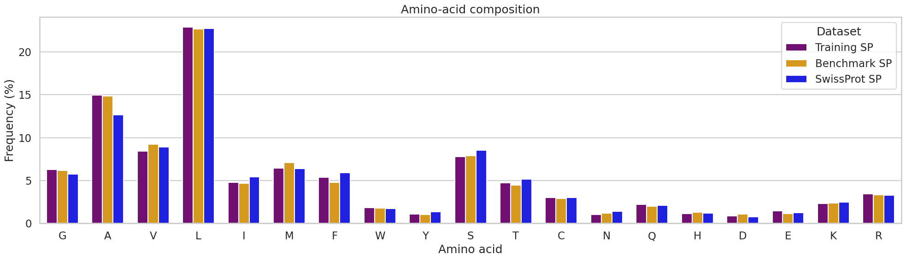
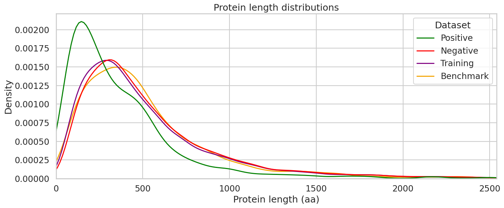
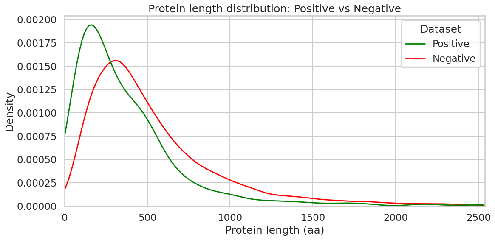
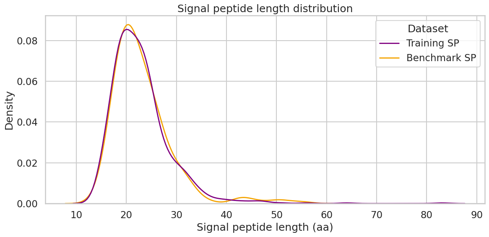
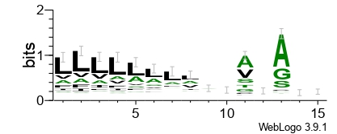
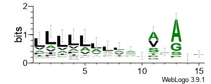
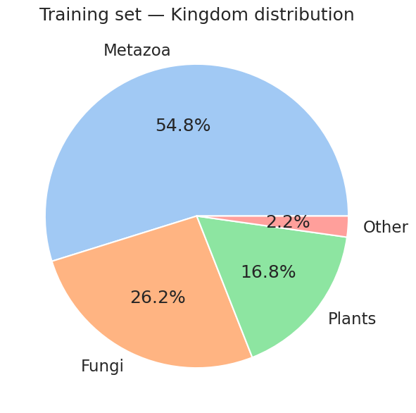
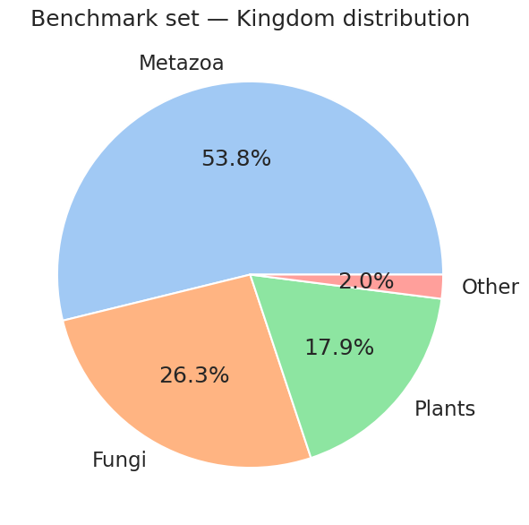
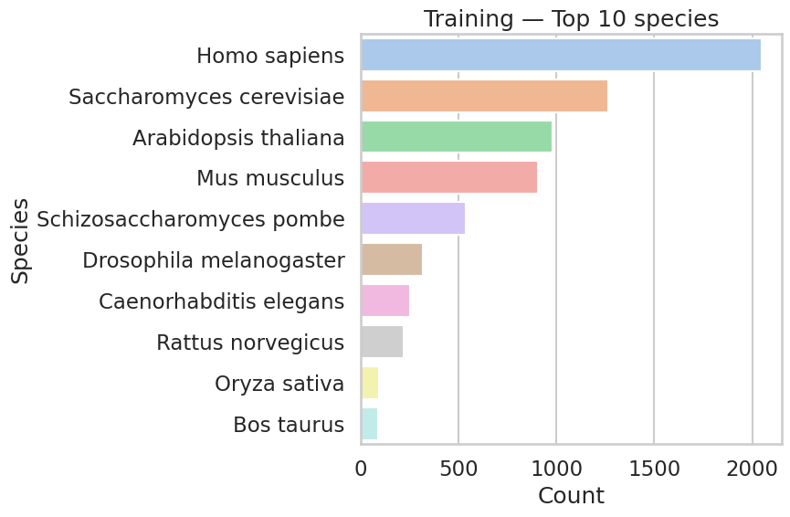
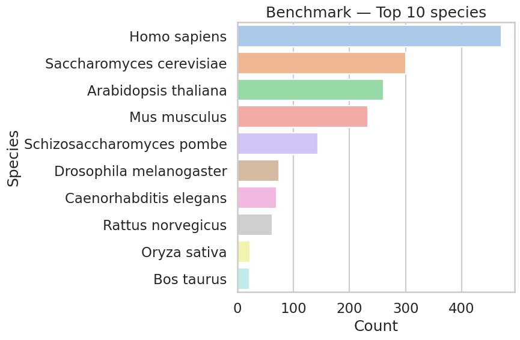

# 🧬 Signal Peptide Prediction

## Laboratory of Bioinformatics II — Module 2
### Group 12: Sajjad - Sara - Roxana 
A computational study of **signal peptide prediction in eukaryotic proteins**, combining classical bioinformatics methods with machine-learning approaches.


---
## ✅ Progress update

### setup
- setup VM, VPN, and github 
- Data collection:

### data collection
> Positive: 2972 retrieved → 2961 final
> 
> Negative: 20975 retrieved(non-conservative) → 19595 final(conservative filter)
### Data preparation
**Reduce redundancy & build splits**
> Redundancy Reduction (MMseqs2): Connected-component clustering (--cluster-mode 1) at >=30% sequence identity and  >=40% bidirectional coverage (--cov-mode 0).
> Positive Dataset: Reduced to 1,061 non-redundant cluster representatives (from 849 training + 212 benchmarking).

> Negative Dataset: Reduced to 8,771 non-redundant cluster representatives (from 7,017 training + 1,754 benchmarking).
>
**80/20 Split:Training Set (80%):**
> Positive: 849 sequences
> Negative: 7,017 sequences
> Total: 7,866 sequences
**Benchmarking Set (20%)**

Positive: 212 sequences

Negative: 1,754 sequences

Total: 1,966 sequences

**Stratified 5-Fold Cross-Validation (Training Set):**
> Negative-to-Positive ratio preserved across all folds at $\approx 8.26 : 1$.
> Fold 0: 1,404 Negative | 170 Positive (Total: 1,574)
> Fold 1: 1,404 Negative | 170 Positive (Total: 1,574)
> Fold 2: 1,403 Negative | 170 Positive (Total: 1,573)
> Fold 3: 1,403 Negative | 170 Positive (Total: 1,573)
> Fold 4: 1,403 Negative | 169 Positive (Total: 1,572)


---

## 🗂️ Repository Structure

```text
LB2/
│
├── README.md
├── .gitignore
│
├── src/
│   └── collect_uniprot_data.py
│
├── data/
│   ├── raw/
│   └── processed/
│
├── notebooks/
│
├── results/
│
└── docs/
```

---

## 👵🏻 Plots

Plot1: 


---

## 📌 Project Overview

Signal peptides (SPs) are short N-terminal amino-acid sequences that direct newly synthesized proteins into the **secretory pathway**, enabling their transport through the endoplasmic reticulum (ER), Golgi apparatus, and ultimately to destinations such as the cell membrane or extracellular space.

Predicting signal peptides from protein sequences is an important problem in **protein function prediction, subcellular localization, and genome/proteome annotation**.

This project investigates different computational approaches for identifying signal peptides and their cleavage sites, starting from classical statistical methods and progressing toward machine-learning approaches.

> **Main question:**  
> Can we reliably distinguish proteins containing signal peptides from proteins without signal peptides using sequence information?

---

## 🎯 Objectives

- Collect and curate a high-quality **eukaryotic protein dataset** from UniProtKB.
- Construct positive and negative datasets for signal peptide prediction.
- Analyze sequence and dataset characteristics.
- Extract informative sequence features.
- Implement the **von Heijne weight-matrix approach** for signal peptide/cleavage-site prediction.
- Implement a **feature-based Support Vector Machine (SVM)** approach.
- Evaluate the models using cross-validation and an independent/blind test set.
- Compare the approaches and analyze their strengths and limitations.
- Discuss more recent approaches to signal peptide prediction.

The project therefore covers both:
1. **Signal peptide detection** — does the protein contain a signal peptide?
2. **Cleavage-site prediction** — where is the signal peptide cleaved?

---

## 🧪 Dataset

Protein sequences are collected from **UniProtKB** and restricted to **eukaryotic proteins**.

### Positive Dataset

Positive examples satisfy the project criteria, including:

- Reviewed UniProt entries
- No protein fragments
- Experimental evidence for a signal peptide
- Protein-level evidence for protein existence
- Protein length ≥ 40 amino acids
- Signal peptide length > 13 amino acids
- Known signal peptide cleavage site

### Negative Dataset

Negative examples satisfy:

- Reviewed UniProt entries
- No protein fragments
- Protein-level evidence for protein existence
- Protein length ≥ 40 amino acids
- No annotated signal peptide at any evidence level
- Experimental localization to selected non-secretory compartments

The datasets will be stored in both **TSV** and **FASTA** formats.

---
### Data analysis

Exploratory data analysis was performed on the non-redundant datasets and on the final training and benchmark sets.

The analysis included:

- Amino-acid composition of signal peptides.
- Comparison with reviewed eukaryotic signal peptides from SwissProt.
- Protein-length distributions.
- Positive vs negative protein-length comparison.
- Signal-peptide-length distributions.
- Taxonomic composition at kingdom level.
- Most represented species in the training and benchmark sets.
- Sequence-logo analysis around the signal-peptide cleavage site.
- Comparison of training and benchmark distributions to evaluate whether the 80/20 split preserved the main characteristics of the dataset.

---

## 📊 Data Analysis

### Amino-acid composition

The amino-acid composition of signal peptides was compared between the **training set**, **benchmark set**, and a reference collection of reviewed eukaryotic signal peptides retrieved from **SwissProt**.

The three distributions are generally similar. Hydrophobic residues are strongly represented, particularly **Leucine (L)** and **Alanine (A)**, which is consistent with the hydrophobic nature of signal peptides.



---

### Protein length distributions

Protein-length distributions were compared across the **positive**, **negative**, **training**, and **benchmark** datasets.

The training and benchmark curves show very similar distributions, suggesting that the 80/20 split preserved the overall protein-length characteristics of the dataset.



The positive and negative datasets were also compared separately.

Positive proteins are more concentrated at shorter protein lengths, whereas the negative dataset has a broader distribution extending toward longer proteins.



---

### Signal peptide length distribution

Signal peptide lengths were compared between positive sequences in the **training** and **benchmark** sets.

The two distributions strongly overlap, with most signal peptides concentrated around approximately **20–25 amino acids**. This indicates that the split preserved the signal-peptide-length distribution.



---

### Cleavage-site sequence logos

Sequence logos were generated for positive proteins to visualize amino-acid preferences around the annotated signal-peptide cleavage site.

For each positive sequence, a window around the cleavage site was extracted, covering:

- **−13 to −1**: residues upstream of the cleavage site  
- **+1 to +2**: residues downstream of the cleavage site  

Separate sequence logos were generated for the **training** and **benchmark** sets to compare positional amino-acid patterns around the cleavage region.

Both datasets show very similar patterns. **Leucine (L)** is strongly enriched in the upstream region, together with other hydrophobic residues such as **Valine (V), Isoleucine (I), and Alanine (A)**. This is expected because the central region of a signal peptide forms a **hydrophobic core**, which is important for recognition by the signal-recognition machinery and interaction with the ER membrane/translocation system.

Close to the cleavage site, **Alanine (A)** is particularly enriched, while **Glycine (G)** and **Serine (S)** are also common. These residues are small and mostly uncharged, making them favorable around the cleavage site where the signal peptidase requires relatively small residues for efficient recognition and cleavage. This pattern is consistent with the classical **−3, −1 rule**, in which small neutral residues are preferred near the signal-peptidase cleavage site.

The similarity between the training and benchmark logos also indicates that the characteristic cleavage-site sequence pattern was preserved after the dataset split.

#### Training set



#### Benchmark set


---

### Taxonomic distribution

The taxonomic composition of the datasets was analyzed to verify whether the training and benchmark sets retained similar biological distributions.

#### Training set

The training set is mainly composed of proteins from **Metazoa**, followed by **Fungi** and **Plants**, with a small fraction belonging to other eukaryotic groups.



#### Benchmark set

The benchmark set shows a very similar kingdom-level composition, suggesting that the 80/20 split preserved the overall taxonomic distribution.



---

### Most represented species

The ten most represented species were examined independently in the training and benchmark sets.

The major species represented in both datasets include **Homo sapiens**, **Saccharomyces cerevisiae**, **Arabidopsis thaliana**, **Mus musculus**, and **Schizosaccharomyces pombe**.

#### Training set



#### Benchmark set



---

### Analysis summary

The exploratory analysis shows that:

- Training and benchmark sets have very similar amino-acid composition patterns.
- Their overall protein-length distributions are also highly similar.
- Positive and negative proteins show different protein-length distributions.
- Signal-peptide-length distributions are strongly consistent between the training and benchmark sets.
- Kingdom-level taxonomic composition is preserved after the 80/20 split.
- The most represented species are similar in both datasets.
- Signal peptides show a strong representation of hydrophobic amino acids.
- Sequence logos were generated around the cleavage site to investigate positional amino-acid preferences in the training and benchmark positive datasets.

Overall, the training and benchmark datasets preserve the main sequence and taxonomic characteristics of the non-redundant dataset and can be used for the subsequent feature extraction, model training, cross-validation, and benchmark evaluation stages.
## 🚀 LINKS

[DeepSig_connected](https://www.connectedpapers.com/main/f5655e2d2c16774c33b17e5a151352a8dfd82255/DeepSig%3A-deep-learning-improves-signal-peptide-detection-in-proteins/graph)
