## von Heijne Signal Peptide Detection Workflow

The project implements the von Heijne method for **Signal Peptide (SP) detection** using a Position-Specific Weight Matrix (PSWM).

### Workflow

```mermaid
flowchart TD

    A["1. Prepare Dataset"] --> B["2. Split Dataset into 5 Folds"]

    B --> C["3. Select Training / Validation / Test Sets"]

    C --> D["4. Extract Cleavage-Site Contexts<br/>from Positive Training Proteins<br/>Positions: -13 to +2"]

    D --> E["5. Build Count Matrix<br/>20 amino acids × 15 positions"]

    E --> F["6. Add Pseudocounts<br/>Initialize every cell with 1"]

    F --> G["7. Compute PSPM<br/>Count / (N + 20)"]

    G --> H["8. Apply SwissProt<br/>Background Distribution"]

    H --> I["9. Compute PSWM<br/>log(PSPM / Background)"]

    I --> J["10. Score Validation Proteins"]

    J --> K["Take first 90 N-terminal residues"]

    K --> L["Slide 15-residue window"]

    L --> M["Score each window"]

    M --> N["Use maximum score<br/>as protein score"]

    N --> O["11. Select Optimal Threshold<br/>using Precision-Recall / F1"]

    O --> P["12. Score Test Proteins<br/>using the same PSWM"]

    P --> Q["13. Classify Test Proteins"]

    Q --> R{"Score ≥ Threshold?"}

    R -->|Yes| S["SP"]
    R -->|No| T["NO_SP"]

    S --> U["14. Evaluate Predictions"]
    T --> U

    U --> V["15. Repeat for All 5 CV Runs"]

    V --> W["16. Combine Results and<br/>Compute Final Performance"]
```



### Step-by-Step Pipeline

1. **Prepare the dataset**
   - Positive proteins: proteins with a Signal Peptide.
   - Negative proteins: proteins without a Signal Peptide.

2. **Split the dataset into 5 folds**
   - 3 folds for training.
   - 1 fold for validation.
   - 1 fold for testing.

3. **Define training, validation, and test sets**
   - Rotate the folds across five cross-validation runs.

4. **Extract cleavage-site contexts**
   - Use only positive proteins from the training set.
   - Extract positions `-13` to `+2` around the cleavage site.
   - Each context contains 15 amino acids.

5. **Build the count matrix**
   - Matrix dimensions: `20 amino acids × 15 positions`.

6. **Add pseudocounts**
   - Initialize every matrix cell with `1`.

7. **Compute the PSPM**
   - Convert counts into probabilities:

   ```text
   PSPM = Count / (N + 20)
   ```

8. **Apply the SwissProt background distribution**
   - Compare the amino-acid probabilities in the motif with their background frequencies.

9. **Compute the PSWM**
   - Calculate the log-odds score:

   ```text
   PSWM = log(PSPM / Background)
   ```

10. **Score validation proteins**
    - Take up to the first 90 N-terminal residues.
    - Scan the sequence using a 15-residue sliding window.
    - Compute one score for each window.
    - Assign the maximum window score as the final protein score.

11. **Select the optimal threshold**
    - Use the validation set.
    - Compute the Precision-Recall curve.
    - Select the threshold that maximizes the F1-score.
    - The test set must not be used for threshold selection.

12. **Score the test proteins**
    - Use the PSWM created from the training data.

13. **Classify test proteins**

    ```text
    Score >= threshold  → SP
    Score < threshold   → NO_SP
    ```

14. **Evaluate test predictions**
    - Compare predicted labels with the true labels.

15. **Repeat the procedure for all 5 cross-validation runs**

16. **Combine the results**
    - Collect predictions from all test folds.
    - Compute the final cross-validation performance.
